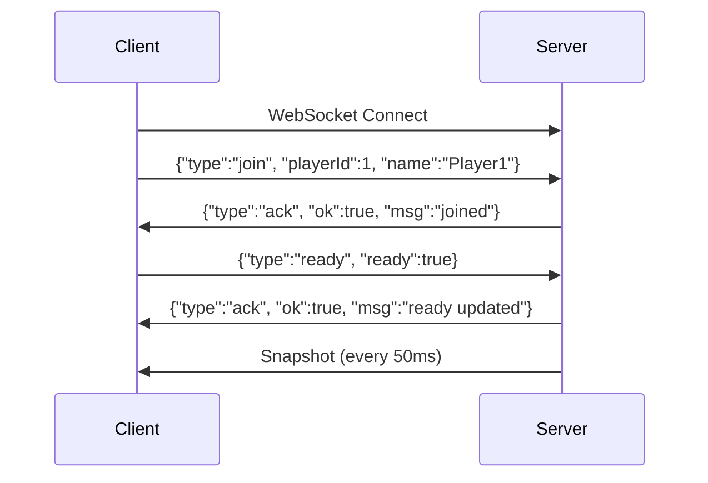

# RTS Server WebSocket API Documentation

**Version:** 1.0.0  
**Last Updated:** January 2026  
**Protocol:** WebSocket (JSON)  
**Server:** Go 1.21+  
**Default Port:** 8080

---

## Table of Contents

1. [Overview](#1-overview)
2. [Quick Start](#2-quick-start)
3. [Connection & Authentication](#3-connection--authentication)
4. [Snapshot Structure](#4-snapshot-structure)
5. [Entity Reference](#5-entity-reference)
6. [Client Commands](#6-client-commands)
7. [Game Mechanics](#7-game-mechanics)
8. [Map & Visibility System](#8-map--visibility-system)
9. [Client Implementation Guide](#9-client-implementation-guide)
10. [Best Practices](#10-best-practices)
11. [Troubleshooting](#11-troubleshooting)

---

## 1. Overview

### Architecture

This RTS server implements an **authoritative server architecture** with:
- **Tick-based simulation** at 50ms intervals (~20 FPS)
- **WebSocket protocol** for real-time bidirectional communication
- **Per-player visibility filtering** (fog of war)
- **Event-driven updates** for efficient state synchronization

### Key Features

- ✅ Real-time multiplayer support
- ✅ Fog of war with line-of-sight calculation
- ✅ Resource gathering and building construction
- ✅ Unit training and combat
- ✅ Procedural map generation (256x256 tiles)
- ✅ Event system for game notifications

---

## 2. Quick Start

### Minimal Integration (5 Steps)

```javascript
// 1. Connect to WebSocket
const ws = new WebSocket("ws://localhost:8080/ws");

// 2. Join game
ws.onopen = () => {
  ws.send(JSON.stringify({
    type: "join",
    playerId: 1,
    name: "Player1"
  }));
  
  // 3. Mark as ready
  ws.send(JSON.stringify({
    type: "ready",
    ready: true
  }));
};

// 4. Listen for snapshots
ws.onmessage = (event) => {
  const data = JSON.parse(event.data);
  
  if (data.type === "snapshot") {
    updateGameState(data);
    renderGame(data);
  }
};

// 5. Send commands
function moveUnit(unitId, x, y) {
  ws.send(JSON.stringify({
    type: "move",
    unitId: unitId,
    x: x,
    y: y
  }));
}
```

---

## 3. Connection & Authentication

### Endpoint

```
ws://<host>:8080/ws
```

### Connection Flow



### Join Message

```json
{
  "type": "join",
  "playerId": 1,
  "name": "PlayerName"
}
```

**Fields:**
- `playerId` (int): Unique player identifier (1-N)
- `name` (string): Display name

### Ready Message

```json
{
  "type": "ready",
  "ready": true
}
```

**Note:** All players must be ready before game simulation starts.

---

## 4. Snapshot Structure

The server broadcasts snapshots every **50ms** to each connected client. Snapshots are **filtered by player visibility**.

### Complete Snapshot Example

```json
{
  "type": "snapshot",
  "tick": 1234,
  "mapWidth": 256,
  "mapHeight": 256,
  
  "units": [
    {
      "id": 101,
      "owner": 1,
      "type": 0,
      "x": 12.0,
      "y": 8.0,
      "hp": 40
    }
  ],
  
  "buildings": [
    {
      "id": 201,
      "owner": 1,
      "type": 0,
      "x": 10.0,
      "y": 10.0,
      "state": 1,
      "progress": 100,
      "hp": 2000,
      "maxHp": 2000
    }
  ],
  
  "enemyUnitsInView": [
    {
      "id": 301,
      "owner": 2,
      "type": 1,
      "x": 15.0,
      "y": 9.0,
      "hp": 60
    }
  ],
  
  "enemyBuildingsInView": [
    {
      "id": 401,
      "owner": 2,
      "type": 1,
      "x": 25.0,
      "y": 25.0,
      "state": 1,
      "progress": 100,
      "hp": 1000,
      "maxHp": 1000
    }
  ],
  
  "resources": [
    {
      "id": 501,
      "type": 0,
      "amount": 180,
      "x": 15.5,
      "y": 7.5
    }
  ],
  
  "events": [
    {
      "type": 6,
      "tick": 1234,
      "entityId": 501,
      "data": {
        "gathered": 10,
        "resourceType": 0
      }
    }
  ],
  
  "playerResources": {
    "food": 100,
    "gold": 50,
    "wood": 200,
    "stone": 0,
    "pop": 3,
    "popCap": 15
  },
  
  "visibleTiles": [
    {"x": 10, "y": 10},
    {"x": 11, "y": 10}
  ],
  
  "seenTiles": [
    {"x": 5, "y": 5},
    {"x": 6, "y": 5}
  ],
  
  "trainingQueues": [
    {
      "buildingId": 201,
      "buildingType": 0,
      "items": [0, 0],
      "currentTime": 50,
      "currentMax": 100
    }
  ]
}
```

### Field Descriptions

| Field | Type | Description |
|-------|------|-------------|
| `tick` | uint64 | Current server tick (increments every 50ms) |
| `mapWidth` | int | Map width in tiles (256) |
| `mapHeight` | int | Map height in tiles (256) |
| `units` | array | Your own units (always visible) |
| `buildings` | array | Your own buildings (always visible) |
| `enemyUnitsInView` | array | Enemy units within line-of-sight |
| `enemyBuildingsInView` | array | Enemy buildings within line-of-sight |
| `resources` | array | Visible resource nodes |
| `events` | array | Recent game events (max 100 per snapshot) |
| `playerResources` | object | Your resource counts and population |
| `visibleTiles` | array | Currently visible tile coordinates (LoS active) |
| `seenTiles` | array | All explored tile coordinates (fog of war) |
| `trainingQueues` | array | Training queues for your buildings |

---

## 5. Entity Reference

### Unit Types

| ID | Name | HP | Speed | Vision | Attack | Range | Cost |
|----|------|----|----|--------|--------|-------|------|
| 0 | **Villager** | 40 | 0.1 | 6 | 5 | 1.5 | 50 food |
| 1 | **Militia** | 60 | 0.15 | 6 | 10 | 1.5 | 60 food, 20 gold |
| 2 | **Animal** | 30 | 0.05 | 0 | 0 | 0 | N/A (neutral) |

**Villager Capabilities:**
- Gather resources (`gather`)
- Build buildings (`build`)
- Deposit resources (`deposit`)
- Hunt animals (`hunt`)

**Militia Capabilities:**
- Attack enemies (`attack`)
- Move (`move`)

### Building Types

| ID | Name | HP | Size | Cost | Training | Population |
|----|------|----|----|------|----------|------------|
| 0 | **TownCenter** | 2000 | 4x4 | Free (starting) | Villagers | +10 cap |
| 1 | **Barracks** | 1000 | 3x3 | 100 wood, 50 stone | Militia | - |
| 2 | **House** | 500 | 2x2 | 30 wood | None | +5 cap |

**Building States:**
- `0` = Constructing
- `1` = Completed

**Construction Time:** 100 ticks (5 seconds at 50ms/tick)

### Resource Types

| ID | Name | Initial Amount | Gathering Rate |
|----|------|----------------|----------------|
| 0 | **Wood** | 200 per tree | 10 per gather |
| 1 | **Gold** | Variable | 10 per gather |
| 2 | **Stone** | Variable | 10 per gather |
| 3 | **Food** | Variable | 10 per gather/hunt |

### Event Types

| ID | Name | Description |
|----|------|-------------|
| 0 | EntityCreate | Entity created or became visible |
| 1 | EntityUpdate | Entity updated (position, HP, etc.) |
| 2 | EntityDestroy | Entity destroyed |
| 3 | EntityHidden | Entity left line-of-sight |
| 4 | FogUpdate | Fog of war updated |
| 5 | QueueProgress | Training queue progressed |
| 6 | ResourceUpdate | Resource gathered/depleted |
| 999 | Overflow | Too many events in one tick (some dropped) |

---

## 6. Client Commands

All commands are JSON messages sent via WebSocket.

### Move Unit

```json
{
  "type": "move",
  "unitId": 101,
  "x": 15.5,
  "y": 12.3
}
```

### Attack Target

```json
{
  "type": "attack",
  "unitId": 101,
  "targetId": 202
}
```

### Build Building

```json
{
  "type": "build",
  "unitId": 101,
  "buildingType": 2,
  "x": 20,
  "y": 15
}
```

**Requirements:**
- Villager must be within 2.0 units of build location
- Player must have sufficient resources
- Location must not be occupied

### Gather Resource

```json
{
  "type": "gather",
  "unitId": 101,
  "resourceId": 301
}
```

### Deposit Resources

```json
{
  "type": "deposit",
  "unitId": 101,
  "buildingId": 201
}
```

**Note:** Only TownCenter accepts deposits.

### Train Unit

```json
{
  "type": "train",
  "buildingId": 201,
  "unitType": 0
}
```

**Training Times:**
- Villager: 100 ticks (5 seconds)
- Militia: 100 ticks (5 seconds)

### Hunt Animal

```json
{
  "type": "hunt",
  "unitId": 101,
  "animalId": 401
}
```

### Command Responses

**Success:**
```json
{
  "type": "ack",
  "ok": true,
  "msg": "Command executed"
}
```

**Error:**
```json
{
  "type": "error",
  "error": "Invalid command: unit not owned"
}
```

---

## 7. Game Mechanics

### Construction System

**Automatic Construction:**
1. Villager executes `build` command
2. Server validates: distance ≤ 2.0, sufficient resources, valid location
3. Building spawns with `state: 0`, `progress: 0`
4. Progress increments automatically: +1 per tick
5. At 100 progress: `state: 1` (completed)

**Important:** Villager does NOT need to stay near the building site.

### Resource Gathering

**Workflow:**
1. Villager executes `gather` command on resource
2. Villager moves to resource
3. +10 resources added per gather (not instant, requires proximity)
4. Resources stored in villager's `carrying` field
5. Villager must `deposit` at TownCenter to transfer to player

**Automatic Client Logic Recommended:**
```javascript
function autoDeposit(villager) {
  const MAX_CARRY = 100; // Define your limit
  
  if (villager.carrying >= MAX_CARRY) {
    const townCenter = findNearestTownCenter(villager.x, villager.y);
    sendCommand({type: "deposit", unitId: villager.id, buildingId: townCenter.id});
  }
}
```

### Combat System

- Melee attacks: range 1.5 units
- Damage dealt per attack:
  - Villager: 5 HP
  - Militia: 10 HP
- Attack cooldown: managed by server
- Units auto-attack nearest enemy in range

### Population System

- Starting population cap: 10
- Each House: +5 cap
- TownCenter: +10 cap (starting building)
- Cannot train units if `pop >= popCap`

---

## 8. Map & Visibility System

### Map Dimensions

- **Size:** 256x256 tiles
- **Coordinate Range:** 0.0 to 256.0 (float positions)
- **Tile Conversion:** `tileX = Math.floor(x)`, `tileY = Math.floor(y)`

### Visibility (Fog of War)

**Three Tile States:**
1. **Visible** (`visibleTiles`): Currently in line-of-sight, render without fog
2. **Seen** (`seenTiles`): Previously explored, render with gray fog
3. **Unseen**: Never explored, render with black fog

**Vision Range:**
- Default: 6 tiles radius per unit/building
- Calculated as circular area around entity

**Client Rendering Logic:**
```javascript
function getTileState(x, y, snapshot) {
  const key = `${x},${y}`;
  
  if (visibleTiles.has(key)) return "VISIBLE";
  if (seenTiles.has(key)) return "SEEN";
  return "UNSEEN";
}
```

### Procedural Map Generation

- Generated once at match start
- Random seed (or specify custom seed)
- ~3,277 trees (1 per 20 tiles average)
- Resources placed randomly without overlap

---

## 9. Client Implementation Guide

### Initialization

```javascript
class RTSGameClient {
  constructor() {
    this.ws = null;
    this.gameState = {
      tick: 0,
      units: {},
      buildings: {},
      resources: {},
      visibleTiles: new Set(),
      seenTiles: new Set()
    };
  }
  
  connect(url) {
    this.ws = new WebSocket(url);
    this.ws.onmessage = (event) => this.handleMessage(event);
  }
  
  join(playerId, name) {
    this.send({type: "join", playerId, name});
    this.send({type: "ready", ready: true});
  }
  
  handleMessage(event) {
    const data = JSON.parse(event.data);
    
    switch(data.type) {
      case "snapshot":
        this.updateState(data);
        this.render();
        break;
      case "ack":
        console.log("Command acknowledged:", data.msg);
        break;
      case "error":
        console.error("Error:", data.error);
        break;
    }
  }
  
  updateState(snapshot) {
    this.gameState.tick = snapshot.tick;
    
    // Update units
    this.gameState.units = {};
    snapshot.units.forEach(u => this.gameState.units[u.id] = u);
    snapshot.enemyUnitsInView.forEach(u => this.gameState.units[u.id] = u);
    
    // Update buildings
    this.gameState.buildings = {};
    snapshot.buildings.forEach(b => this.gameState.buildings[b.id] = b);
    snapshot.enemyBuildingsInView.forEach(b => this.gameState.buildings[b.id] = b);
    
    // Update resources
    this.gameState.resources = {};
    snapshot.resources.forEach(r => this.gameState.resources[r.id] = r);
    
    // Update visibility
    this.gameState.visibleTiles = new Set(
      snapshot.visibleTiles.map(t => `${t.x},${t.y}`)
    );
    this.gameState.seenTiles = new Set(
      snapshot.seenTiles.map(t => `${t.x},${t.y}`)
    );
  }
  
  send(command) {
    this.ws.send(JSON.stringify(command));
  }
}
```

### Rendering Example (Canvas)

```javascript
function renderGame(ctx, gameState) {
  const TILE_SIZE = 32;
  
  // Render tiles
  for (let y = 0; y < 256; y++) {
    for (let x = 0; x < 256; x++) {
      const key = `${x},${y}`;
      const screenX = x * TILE_SIZE;
      const screenY = y * TILE_SIZE;
      
      if (gameState.visibleTiles.has(key)) {
        ctx.fillStyle = '#90EE90'; // Green grass
      } else if (gameState.seenTiles.has(key)) {
        ctx.fillStyle = 'rgba(0,0,0,0.5)'; // Gray fog
      } else {
        ctx.fillStyle = 'black'; // Black fog
      }
      
      ctx.fillRect(screenX, screenY, TILE_SIZE, TILE_SIZE);
    }
  }
  
  // Render entities
  Object.values(gameState.resources).forEach(r => drawResource(ctx, r));
  Object.values(gameState.buildings).forEach(b => drawBuilding(ctx, b));
  Object.values(gameState.units).forEach(u => drawUnit(ctx, u));
}
```

---

## 10. Best Practices

### Performance Optimization

1. **Delta Updates:** Only re-render tiles/entities that changed
2. **Viewport Culling:** Only render visible screen area, not entire 256x256 map
3. **Entity Caching:** Store last known entity positions for fog-of-war rendering
4. **Batch Commands:** Send multiple commands in quick succession without waiting for acks

### State Management

1. **Server Authority:** Never trust client-side calculations—always use snapshot data
2. **Optimistic Updates:** Update UI immediately, rollback on error
3. **Event Handling:** Use event system for animations/effects

### Error Handling

```javascript
ws.onerror = (error) => {
  console.error("WebSocket error:", error);
  // Attempt reconnection
};

ws.onclose = () => {
  console.log("Connection closed, reconnecting...");
  setTimeout(() => connect(), 3000);
};
```

---

## 11. Troubleshooting

### Common Issues

**Issue:** No snapshots received after joining  
**Solution:** Ensure you sent both `join` and `ready` messages

**Issue:** Commands rejected with "unit not owned"  
**Solution:** Verify `unitId` belongs to your player

**Issue:** Building construction fails  
**Solution:** Check villager distance (≤2.0) and resource availability

**Issue:** Units not visible  
**Solution:** Check if units are within visibility range (`visibleTiles`)

### Debug Tips

1. Enable console logging for all WebSocket messages
2. Verify snapshot `tick` is incrementing (should increase by 1 every 50ms)
3. Check `playerResources` for current resource counts
4. Monitor `events` array for game notifications

### Server Logs

Server logs are available at:
- Console output: Real-time command execution
- Metrics endpoint: `http://localhost:8080/metrics`

---

## Appendix A: Complete Command Reference

| Command | Required Fields | Optional Fields | Description |
|---------|----------------|-----------------|-------------|
| `join` | `playerId`, `name` | - | Join game session |
| `ready` | `ready` | - | Mark player as ready |
| `move` | `unitId`, `x`, `y` | - | Move unit to position |
| `attack` | `unitId`, `targetId` | - | Attack target entity |
| `build` | `unitId`, `buildingType`, `x`, `y` | - | Construct building |
| `gather` | `unitId`, `resourceId` | - | Gather resource |
| `deposit` | `unitId`, `buildingId` | - | Deposit resources |
| `train` | `buildingId`, `unitType` | - | Train unit in building |
| `hunt` | `unitId`, `animalId` | - | Hunt animal for food |

---

## Appendix B: Event Data Structures

### EntityDestroy Event
```json
{
  "type": 2,
  "tick": 1230,
  "entityId": 199,
  "data": {
    "destroyed": true,
    "killer": 301
  }
}
```

### ResourceUpdate Event
```json
{
  "type": 6,
  "tick": 1234,
  "entityId": 501,
  "data": {
    "gathered": 10,
    "resourceType": 0
  }
}
```

### QueueProgress Event
```json
{
  "type": 5,
  "tick": 1234,
  "entityId": 201,
  "data": {
    "progress": 50,
    "unitType": 1,
    "buildingId": 201
  }
}
```

---

**End of Documentation**
