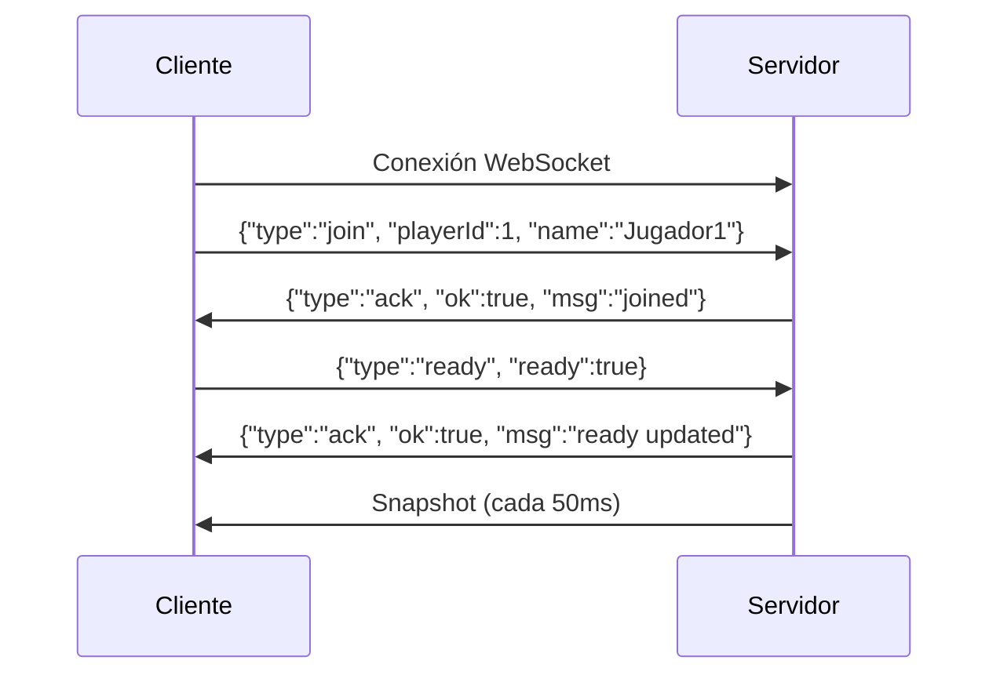

# Documentación API WebSocket del Servidor RTS

**Versión:** 1.0.0  
**Última Actualización:** Enero 2026  
**Protocolo:** WebSocket (JSON)  
**Servidor:** Go 1.21+  
**Puerto Predeterminado:** 8080

---

## Tabla de Contenidos

1. [Descripción General](#1-descripción-general)
2. [Inicio Rápido](#2-inicio-rápido)
3. [Conexión y Autenticación](#3-conexión-y-autenticación)
4. [Estructura del Snapshot](#4-estructura-del-snapshot)
5. [Referencia de Entidades](#5-referencia-de-entidades)
6. [Comandos del Cliente](#6-comandos-del-cliente)
7. [Mecánicas del Juego](#7-mecánicas-del-juego)
8. [Sistema de Mapa y Visibilidad](#8-sistema-de-mapa-y-visibilidad)
9. [Guía de Implementación del Cliente](#9-guía-de-implementación-del-cliente)
10. [Mejores Prácticas](#10-mejores-prácticas)
11. [Solución de Problemas](#11-solución-de-problemas)

---

## 1. Descripción General

### Arquitectura

Este servidor RTS implementa una **arquitectura autoritativa de servidor** con:
- **Simulación basada en ticks** a intervalos de 50ms (~20 FPS)
- **Protocolo WebSocket** para comunicación bidireccional en tiempo real
- **Filtrado de visibilidad por jugador** (niebla de guerra)
- **Actualizaciones por eventos** para sincronización eficiente del estado

### Características Principales

- ✅ Soporte multijugador en tiempo real
- ✅ Niebla de guerra con cálculo de línea de visión
- ✅ Recolección de recursos y construcción de edificios
- ✅ Entrenamiento de unidades y combate
- ✅ Generación procedural de mapas (256x256 tiles)
- ✅ Sistema de eventos para notificaciones del juego

---

## 2. Inicio Rápido

### Integración Mínima (5 Pasos)

```javascript
// 1. Conectar al WebSocket
const ws = new WebSocket("ws://localhost:8080/ws");

// 2. Unirse al juego
ws.onopen = () => {
  ws.send(JSON.stringify({
    type: "join",
    playerId: 1,
    name: "Jugador1"
  }));
  
  // 3. Marcar como listo
  ws.send(JSON.stringify({
    type: "ready",
    ready: true
  }));
};

// 4. Escuchar snapshots
ws.onmessage = (event) => {
  const data = JSON.parse(event.data);
  
  if (data.type === "snapshot") {
    actualizarEstadoJuego(data);
    renderizarJuego(data);
  }
};

// 5. Enviar comandos
function moverUnidad(unitId, x, y) {
  ws.send(JSON.stringify({
    type: "move",
    unitId: unitId,
    x: x,
    y: y
  }));
}
```

---

## 3. Conexión y Autenticación

### Endpoint

```
ws://<host>:8080/ws
```

### Flujo de Conexión



### Mensaje de Unión

```json
{
  "type": "join",
  "playerId": 1,
  "name": "NombreJugador"
}
```

**Campos:**
- `playerId` (int): Identificador único del jugador (1-N)
- `name` (string): Nombre de visualización

### Mensaje de Listo

```json
{
  "type": "ready",
  "ready": true
}
```

**Nota:** Todos los jugadores deben estar listos antes de que inicie la simulación del juego.

---

## 4. Estructura del Snapshot

El servidor transmite snapshots cada **50ms** a cada cliente conectado. Los snapshots están **filtrados por visibilidad del jugador**.

### Ejemplo de Snapshot Completo

```json
{
  "type": "snapshot",
  "tick": 1234,
  "mapWidth": 256,
  "mapHeight": 256,
  
  "units": [
    {
      "id": 101,
      "owner": 1,
      "type": 0,
      "x": 12.0,
      "y": 8.0,
      "hp": 40
    }
  ],
  
  "buildings": [
    {
      "id": 201,
      "owner": 1,
      "type": 0,
      "x": 10.0,
      "y": 10.0,
      "state": 1,
      "progress": 100,
      "hp": 2000,
      "maxHp": 2000
    }
  ],
  
  "enemyUnitsInView": [
    {
      "id": 301,
      "owner": 2,
      "type": 1,
      "x": 15.0,
      "y": 9.0,
      "hp": 60
    }
  ],
  
  "enemyBuildingsInView": [
    {
      "id": 401,
      "owner": 2,
      "type": 1,
      "x": 25.0,
      "y": 25.0,
      "state": 1,
      "progress": 100,
      "hp": 1000,
      "maxHp": 1000
    }
  ],
  
  "resources": [
    {
      "id": 501,
      "type": 0,
      "amount": 180,
      "x": 15.5,
      "y": 7.5
    }
  ],
  
  "events": [
    {
      "type": 6,
      "tick": 1234,
      "entityId": 501,
      "data": {
        "gathered": 10,
        "resourceType": 0
      }
    }
  ],
  
  "playerResources": {
    "food": 100,
    "gold": 50,
    "wood": 200,
    "stone": 0,
    "pop": 3,
    "popCap": 15
  },
  
  "visibleTiles": [
    {"x": 10, "y": 10},
    {"x": 11, "y": 10}
  ],
  
  "seenTiles": [
    {"x": 5, "y": 5},
    {"x": 6, "y": 5}
  ],
  
  "trainingQueues": [
    {
      "buildingId": 201,
      "buildingType": 0,
      "items": [0, 0],
      "currentTime": 50,
      "currentMax": 100
    }
  ]
}
```

### Descripción de Campos

| Campo | Tipo | Descripción |
|-------|------|-------------|
| `tick` | uint64 | Tick actual del servidor (incrementa cada 50ms) |
| `mapWidth` | int | Ancho del mapa en tiles (256) |
| `mapHeight` | int | Alto del mapa en tiles (256) |
| `units` | array | Tus propias unidades (siempre visibles) |
| `buildings` | array | Tus propios edificios (siempre visibles) |
| `enemyUnitsInView` | array | Unidades enemigas dentro de la línea de visión |
| `enemyBuildingsInView` | array | Edificios enemigos dentro de la línea de visión |
| `resources` | array | Nodos de recursos visibles |
| `events` | array | Eventos recientes del juego (máx 100 por snapshot) |
| `playerResources` | object | Tus conteos de recursos y población |
| `visibleTiles` | array | Coordenadas de tiles actualmente visibles (LoS activo) |
| `seenTiles` | array | Todas las coordenadas de tiles explorados (niebla de guerra) |
| `trainingQueues` | array | Colas de entrenamiento para tus edificios |

---

## 5. Referencia de Entidades

### Tipos de Unidades

| ID | Nombre | HP | Velocidad | Visión | Ataque | Rango | Costo |
|----|--------|----|----|--------|--------|-------|------|
| 0 | **Villager** (Aldeano) | 40 | 0.1 | 6 | 5 | 1.5 | 50 comida |
| 1 | **Militia** (Milicia) | 60 | 0.15 | 6 | 10 | 1.5 | 60 comida, 20 oro |
| 2 | **Animal** | 30 | 0.05 | 0 | 0 | 0 | N/A (neutral) |

**Capacidades del Villager:**
- Recolectar recursos (`gather`)
- Construir edificios (`build`)
- Depositar recursos (`deposit`)
- Cazar animales (`hunt`)

**Capacidades de la Militia:**
- Atacar enemigos (`attack`)
- Moverse (`move`)

### Tipos de Edificios

| ID | Nombre | HP | Tamaño | Costo | Entrenamiento | Población |
|----|--------|----|----|------|---------------|-----------|
| 0 | **TownCenter** | 2000 | 4x4 | Gratis (inicial) | Villagers | +10 cap |
| 1 | **Barracks** | 1000 | 3x3 | 100 madera, 50 piedra | Militia | - |
| 2 | **House** (Casa) | 500 | 2x2 | 30 madera | Ninguno | +5 cap |

**Estados de Edificio:**
- `0` = Construyendo
- `1` = Completado

**Tiempo de Construcción:** 100 ticks (5 segundos a 50ms/tick)

### Tipos de Recursos

| ID | Nombre | Cantidad Inicial | Tasa de Recolección |
|----|------|------------------|---------------------|
| 0 | **Wood** (Madera) | 200 por árbol | 10 por recolección |
| 1 | **Gold** (Oro) | Variable | 10 por recolección |
| 2 | **Stone** (Piedra) | Variable | 10 por recolección |
| 3 | **Food** (Comida) | Variable | 10 por recolección/caza |

### Tipos de Eventos

| ID | Nombre | Descripción |
|----|------|-------------|
| 0 | EntityCreate | Entidad creada o se volvió visible |
| 1 | EntityUpdate | Entidad actualizada (posición, HP, etc.) |
| 2 | EntityDestroy | Entidad destruida |
| 3 | EntityHidden | Entidad salió de la línea de visión |
| 4 | FogUpdate | Niebla de guerra actualizada |
| 5 | QueueProgress | Cola de entrenamiento progresó |
| 6 | ResourceUpdate | Recurso recolectado/agotado |
| 999 | Overflow | Demasiados eventos en un tick (algunos descartados) |

---

## 6. Comandos del Cliente

Todos los comandos son mensajes JSON enviados vía WebSocket.

### Mover Unidad

```json
{
  "type": "move",
  "unitId": 101,
  "x": 15.5,
  "y": 12.3
}
```

### Atacar Objetivo

```json
{
  "type": "attack",
  "unitId": 101,
  "targetId": 202
}
```

### Construir Edificio

```json
{
  "type": "build",
  "unitId": 101,
  "buildingType": 2,
  "x": 20,
  "y": 15
}
```

**Requisitos:**
- El Villager debe estar dentro de 2.0 unidades de la ubicación de construcción
- El jugador debe tener recursos suficientes
- La ubicación no debe estar ocupada

### Recolectar Recurso

```json
{
  "type": "gather",
  "unitId": 101,
  "resourceId": 301
}
```

### Depositar Recursos

```json
{
  "type": "deposit",
  "unitId": 101,
  "buildingId": 201
}
```

**Nota:** Solo el TownCenter acepta depósitos.

### Entrenar Unidad

```json
{
  "type": "train",
  "buildingId": 201,
  "unitType": 0
}
```

**Tiempos de Entrenamiento:**
- Villager: 100 ticks (5 segundos)
- Militia: 100 ticks (5 segundos)

### Cazar Animal

```json
{
  "type": "hunt",
  "unitId": 101,
  "animalId": 401
}
```

### Respuestas de Comandos

**Éxito:**
```json
{
  "type": "ack",
  "ok": true,
  "msg": "Comando ejecutado"
}
```

**Error:**
```json
{
  "type": "error",
  "error": "Comando inválido: unidad no pertenece al jugador"
}
```

---

## 7. Mecánicas del Juego

### Sistema de Construcción

**Construcción Automática:**
1. El Villager ejecuta el comando `build`
2. El servidor valida: distancia ≤ 2.0, recursos suficientes, ubicación válida
3. El edificio aparece con `state: 0`, `progress: 0`
4. El progreso se incrementa automáticamente: +1 por tick
5. Al llegar a 100 de progreso: `state: 1` (completado)

**Importante:** El Villager NO necesita quedarse cerca del sitio de construcción.

### Recolección de Recursos

**Flujo de trabajo:**
1. El Villager ejecuta el comando `gather` sobre un recurso
2. El Villager se mueve al recurso
3. +10 recursos añadidos por recolección (no es instantáneo, requiere proximidad)
4. Los recursos se almacenan en el campo `carrying` del villager
5. El Villager debe hacer `deposit` en el TownCenter para transferir al jugador

**Lógica Automática del Cliente Recomendada:**
```javascript
function depositoAutomatico(villager) {
  const MAX_CARGA = 100; // Define tu límite
  
  if (villager.carrying >= MAX_CARGA) {
    const townCenter = encontrarTownCenterMasCercano(villager.x, villager.y);
    enviarComando({type: "deposit", unitId: villager.id, buildingId: townCenter.id});
  }
}
```

### Sistema de Combate

- Ataques cuerpo a cuerpo: rango 1.5 unidades
- Daño infligido por ataque:
  - Villager: 5 HP
  - Militia: 10 HP
- Cooldown de ataque: gestionado por el servidor
- Las unidades atacan automáticamente al enemigo más cercano en rango

### Sistema de Población

- Capacidad de población inicial: 10
- Cada Casa: +5 cap
- TownCenter: +10 cap (edificio inicial)
- No se pueden entrenar unidades si `pop >= popCap`

---

## 8. Sistema de Mapa y Visibilidad

### Dimensiones del Mapa

- **Tamaño:** 256x256 tiles
- **Rango de Coordenadas:** 0.0 a 256.0 (posiciones float)
- **Conversión de Tile:** `tileX = Math.floor(x)`, `tileY = Math.floor(y)`

### Visibilidad (Niebla de Guerra)

**Tres Estados de Tile:**
1. **Visible** (`visibleTiles`): Actualmente en línea de visión, renderizar sin niebla
2. **Visto** (`seenTiles`): Previamente explorado, renderizar con niebla gris
3. **No visto**: Nunca explorado, renderizar con niebla negra

**Rango de Visión:**
- Predeterminado: 6 tiles de radio por unidad/edificio
- Calculado como área circular alrededor de la entidad

**Lógica de Renderizado del Cliente:**
```javascript
function obtenerEstadoTile(x, y, snapshot) {
  const key = `${x},${y}`;
  
  if (visibleTiles.has(key)) return "VISIBLE";
  if (seenTiles.has(key)) return "VISTO";
  return "NO_VISTO";
}
```

### Generación Procedural del Mapa

- Generado una vez al inicio de la partida
- Semilla aleatoria (o especificar semilla personalizada)
- ~3,277 árboles (1 por cada 20 tiles en promedio)
- Recursos colocados aleatoriamente sin superposición

---

## 9. Guía de Implementación del Cliente

### Inicialización

```javascript
class ClienteJuegoRTS {
  constructor() {
    this.ws = null;
    this.estadoJuego = {
      tick: 0,
      units: {},
      buildings: {},
      resources: {},
      visibleTiles: new Set(),
      seenTiles: new Set()
    };
  }
  
  conectar(url) {
    this.ws = new WebSocket(url);
    this.ws.onmessage = (event) => this.manejarMensaje(event);
  }
  
  unirse(playerId, name) {
    this.enviar({type: "join", playerId, name});
    this.enviar({type: "ready", ready: true});
  }
  
  manejarMensaje(event) {
    const data = JSON.parse(event.data);
    
    switch(data.type) {
      case "snapshot":
        this.actualizarEstado(data);
        this.renderizar();
        break;
      case "ack":
        console.log("Comando confirmado:", data.msg);
        break;
      case "error":
        console.error("Error:", data.error);
        break;
    }
  }
  
  actualizarEstado(snapshot) {
    this.estadoJuego.tick = snapshot.tick;
    
    // Actualizar unidades
    this.estadoJuego.units = {};
    snapshot.units.forEach(u => this.estadoJuego.units[u.id] = u);
    snapshot.enemyUnitsInView.forEach(u => this.estadoJuego.units[u.id] = u);
    
    // Actualizar edificios
    this.estadoJuego.buildings = {};
    snapshot.buildings.forEach(b => this.estadoJuego.buildings[b.id] = b);
    snapshot.enemyBuildingsInView.forEach(b => this.estadoJuego.buildings[b.id] = b);
    
    // Actualizar recursos
    this.estadoJuego.resources = {};
    snapshot.resources.forEach(r => this.estadoJuego.resources[r.id] = r);
    
    // Actualizar visibilidad
    this.estadoJuego.visibleTiles = new Set(
      snapshot.visibleTiles.map(t => `${t.x},${t.y}`)
    );
    this.estadoJuego.seenTiles = new Set(
      snapshot.seenTiles.map(t => `${t.x},${t.y}`)
    );
  }
  
  enviar(comando) {
    this.ws.send(JSON.stringify(comando));
  }
}
```

### Ejemplo de Renderizado (Canvas)

```javascript
function renderizarJuego(ctx, estadoJuego) {
  const TAMANO_TILE = 32;
  
  // Renderizar tiles
  for (let y = 0; y < 256; y++) {
    for (let x = 0; x < 256; x++) {
      const key = `${x},${y}`;
      const screenX = x * TAMANO_TILE;
      const screenY = y * TAMANO_TILE;
      
      if (estadoJuego.visibleTiles.has(key)) {
        ctx.fillStyle = '#90EE90'; // Pasto verde
      } else if (estadoJuego.seenTiles.has(key)) {
        ctx.fillStyle = 'rgba(0,0,0,0.5)'; // Niebla gris
      } else {
        ctx.fillStyle = 'black'; // Niebla negra
      }
      
      ctx.fillRect(screenX, screenY, TAMANO_TILE, TAMANO_TILE);
    }
  }
  
  // Renderizar entidades
  Object.values(estadoJuego.resources).forEach(r => dibujarRecurso(ctx, r));
  Object.values(estadoJuego.buildings).forEach(b => dibujarEdificio(ctx, b));
  Object.values(estadoJuego.units).forEach(u => dibujarUnidad(ctx, u));
}
```

---

## 10. Mejores Prácticas

### Optimización de Rendimiento

1. **Actualizaciones Delta:** Solo re-renderizar tiles/entidades que cambiaron
2. **Culling de Viewport:** Solo renderizar área visible en pantalla, no todo el mapa 256x256
3. **Caché de Entidades:** Almacenar últimas posiciones conocidas de entidades para renderizado en niebla de guerra
4. **Comandos por Lotes:** Enviar múltiples comandos en rápida sucesión sin esperar confirmaciones

### Gestión de Estado

1. **Autoridad del Servidor:** Nunca confiar en cálculos del cliente—siempre usar datos del snapshot
2. **Actualizaciones Optimistas:** Actualizar UI inmediatamente, revertir en caso de error
3. **Manejo de Eventos:** Usar sistema de eventos para animaciones/efectos

### Manejo de Errores

```javascript
ws.onerror = (error) => {
  console.error("Error de WebSocket:", error);
  // Intentar reconexión
};

ws.onclose = () => {
  console.log("Conexión cerrada, reconectando...");
  setTimeout(() => conectar(), 3000);
};
```

---

## 11. Solución de Problemas

### Problemas Comunes

**Problema:** No se reciben snapshots después de unirse  
**Solución:** Asegúrate de haber enviado ambos mensajes `join` y `ready`

**Problema:** Comandos rechazados con "unit not owned"  
**Solución:** Verifica que el `unitId` pertenezca a tu jugador

**Problema:** La construcción de edificios falla  
**Solución:** Verifica la distancia del villager (≤2.0) y disponibilidad de recursos

**Problema:** Unidades no visibles  
**Solución:** Verifica si las unidades están dentro del rango de visibilidad (`visibleTiles`)

### Consejos de Debug

1. Habilitar registro en consola para todos los mensajes WebSocket
2. Verificar que el `tick` del snapshot esté incrementando (debería aumentar en 1 cada 50ms)
3. Revisar `playerResources` para conteos actuales de recursos
4. Monitorear el array `events` para notificaciones del juego

### Logs del Servidor

Los logs del servidor están disponibles en:
- Salida de consola: Ejecución de comandos en tiempo real
- Endpoint de métricas: `http://localhost:8080/metrics`

---

## Apéndice A: Referencia Completa de Comandos

| Comando | Campos Requeridos | Campos Opcionales | Descripción |
|---------|------------------|-------------------|-------------|
| `join` | `playerId`, `name` | - | Unirse a sesión de juego |
| `ready` | `ready` | - | Marcar jugador como listo |
| `move` | `unitId`, `x`, `y` | - | Mover unidad a posición |
| `attack` | `unitId`, `targetId` | - | Atacar entidad objetivo |
| `build` | `unitId`, `buildingType`, `x`, `y` | - | Construir edificio |
| `gather` | `unitId`, `resourceId` | - | Recolectar recurso |
| `deposit` | `unitId`, `buildingId` | - | Depositar recursos |
| `train` | `buildingId`, `unitType` | - | Entrenar unidad en edificio |
| `hunt` | `unitId`, `animalId` | - | Cazar animal para comida |

---

## Apéndice B: Estructuras de Datos de Eventos

### Evento EntityDestroy
```json
{
  "type": 2,
  "tick": 1230,
  "entityId": 199,
  "data": {
    "destroyed": true,
    "killer": 301
  }
}
```

### Evento ResourceUpdate
```json
{
  "type": 6,
  "tick": 1234,
  "entityId": 501,
  "data": {
    "gathered": 10,
    "resourceType": 0
  }
}
```

### Evento QueueProgress
```json
{
  "type": 5,
  "tick": 1234,
  "entityId": 201,
  "data": {
    "progress": 50,
    "unitType": 1,
    "buildingId": 201
  }
}
```

---

**Fin de la Documentación**
